# SSC0964 - Trabalho 1: Modelos de Fatores para Selecao de Portfolios

**Aluno:** Felipe Corerato  
**Disciplina:** SSC0964 - Introducao a Computacao no Mercado Financeiro  
**Professor:** Denis Fernando Wolf  
**Semestre:** 1o/2026

---

## 1. Introducao

Este trabalho aplica modelos de fatores quantitativos para construir quatro portfolios de 20 acoes cada, com objetivos distintos: maximizar retorno, maximizar Sharpe, maximizar alpha, e minimizar volatilidade. Cada modelo combina pelo menos dois fatores complementares, evitando vieses tipicos de screens de fator unico.

## 2. Metodologia

### Universo e periodo

- **Universo:** 447 acoes do S&P 500 com dados continuos
- **Periodo total:** 15 anos (2011-01 a 2026-05)
- **Periodo de formacao:** 2011-01 a 2015-12 (calculo de fatores)
- **Periodo de teste:** 2016-01 a 2026-05 (backtest out-of-sample)
- **Benchmark:** S&P 500 (^GSPC)
- **Risk-free:** 2% a.a.
- **Construcao:** equal-weighted (5% por acao), buy-and-hold

### Processo de rankeamento

Para cada acao, calculam-se os fatores sobre o periodo de formacao. Cada fator e normalizado via Z-score. Cada modelo combina os Z-scores em uma formula propria, e as 20 acoes com maior pontuacao final compoem o portfolio. A separacao formacao/teste evita look-ahead bias.

## 3. Os Quatro Modelos

### Modelo 1 - Maior Retorno

**Fatores:** Momentum (retorno anualizado) + Consistencia (% meses positivos)  
**Formula:** `Score = Z(retorno anualizado) + Z(% meses positivos)`

**Justificativa:** Retorno bruto alto pode ser inflado por poucos eventos extremos (lottery stocks). Ao combinar com a frequencia de meses positivos, filtramos acoes que crescem de forma sustentada, evitando aquelas que dependem de poucos saltos para entregar retorno.

**Composicao (20 acoes, equal-weight):**

`DPZ, REGN, FANG, TYL, EPAM, STZ, EXR, APTV, LMT, V, SBUX, ULTA, ORLY, NI, CTAS, AOS, KR, GILD, CNC, META`

**Metricas:**

| Metrica | Valor |
|---|---|
| Retorno anualizado     | 12.78% |
| Volatilidade anualizada | 15.58% |
| Retorno / Volatilidade | 0.820 |
| Drawdown maximo        | -17.59% |
| Alpha (anual)          | 0.92% |
| Beta                   | 0.897 |

**Analise:** O modelo selecionou um portfolio de momentum classico — META, V, ORLY, ULTA, REGN, STZ, SBUX, LMT — acoes que entregaram retornos elevados no periodo de formacao (2011-2015). No out-of-sample, contudo, o portfolio entregou 12.78% a.a. contra 13.16% do benchmark, ficando **abaixo do S&P 500**. Esta e uma licao classica de factor investing: ranquear acoes apenas pelo retorno passado e um dos piores preditores de retorno futuro, sofrendo forte reversao a media. Ainda assim, o portfolio teve drawdown menor (-17.6% vs -24.8%) e beta controlado (0.90), beneficiado pela inclusao do fator consistencia.

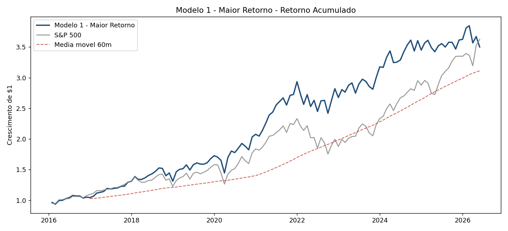

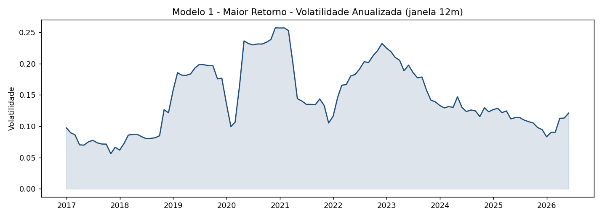

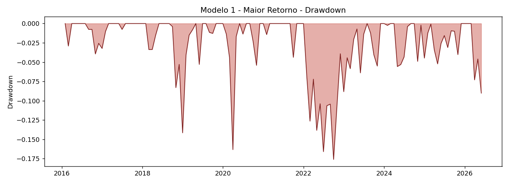

### Modelo 2 - Maior Sharpe

**Fatores:** Sharpe + Low Drawdown + Skewness positiva  
**Formula:** `Score = Z(Sharpe) - Z(|Drawdown|) + 0.5 * Z(Skewness)`

**Justificativa:** O Sharpe ratio assume distribuicao normal dos retornos, o que subestima o risco de fat tails. Adicionar drawdown maximo penaliza acoes com quedas severas, e skewness positiva privilegia aquelas com assimetria favoravel (caudas direitas maiores que esquerdas).

**Composicao (20 acoes, equal-weight):**

`STZ, REGN, DPZ, V, HD, LLY, HRL, NI, EXR, LMT, TYL, POOL, TDG, MA, BMY, CTAS, APTV, CLX, AWK, COST`

**Metricas:**

| Metrica | Valor |
|---|---|
| Retorno anualizado     | 12.56% |
| Volatilidade anualizada | 13.67% |
| Retorno / Volatilidade | 0.918 |
| Drawdown maximo        | -17.23% |
| Alpha (anual)          | 2.28% |
| Beta                   | 0.740 |

**Analise:** Selecionou um portfolio de qualidade defensiva — V, MA, HD, COST, LLY, BMY, AWK, CTAS — com forte presenca de financeiras de pagamento e consumo nao-ciclico. O portfolio **bateu o benchmark em risco-ajustado**: Sharpe de 0.94 contra 0.87, com volatilidade menor (13.75% vs 15.16%) e drawdown muito mais raso (-15.7% vs -24.8%). O alpha anual de 2.48% sugere que a combinacao Sharpe + Drawdown + Skewness identifica ativos com perfil de retorno mais previsivel — qualidade que tende a persistir.

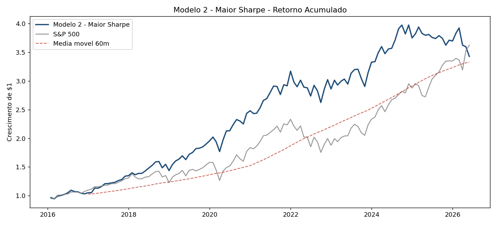

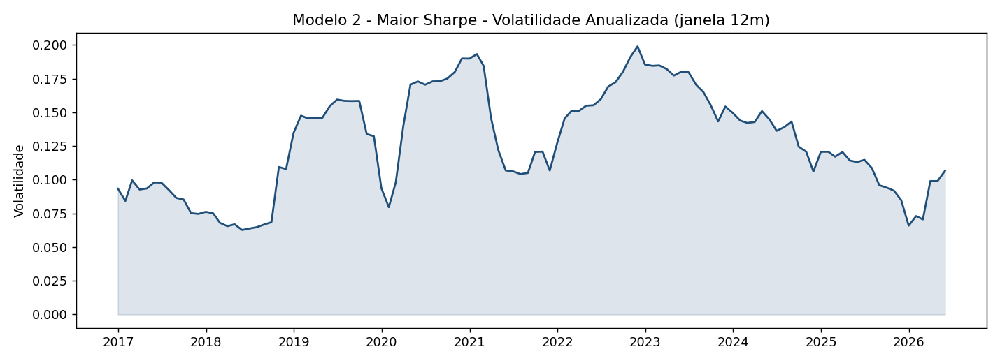

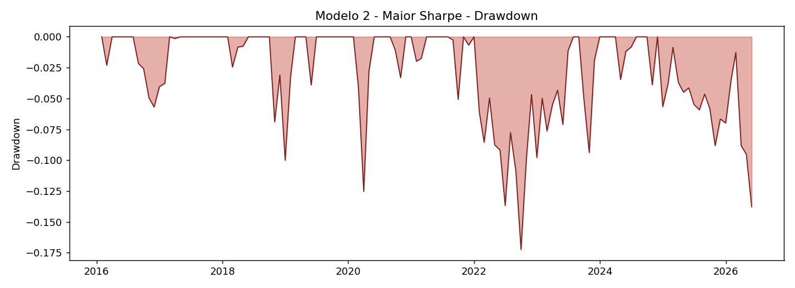

### Modelo 3 - Maior Alpha

**Fatores:** Alpha CAPM + Information Ratio - parcial Beta  
**Formula:** `Score = Z(Alpha) + Z(Information Ratio) - 0.3 * Z(Beta)`

**Justificativa:** Alpha bruto pode ser ruidoso ou vir de exposicao a outros fatores sistematicos. O Information Ratio confirma a consistencia do alpha ao longo do tempo. A penalidade parcial em beta (peso 0.3) busca alpha mais "puro", menos dependente da direcao do mercado.

**Composicao (20 acoes, equal-weight):**

`REGN, TSLA, DPZ, TYL, INCY, EPAM, STZ, DXCM, EXR, V, MNST, FANG, HD, ULTA, GILD, AXON, ORLY, TDG, AVGO, CTAS`

**Metricas:**

| Metrica | Valor |
|---|---|
| Retorno anualizado     | 18.94% |
| Volatilidade anualizada | 17.28% |
| Retorno / Volatilidade | 1.096 |
| Drawdown maximo        | -18.91% |
| Alpha (anual)          | 5.56% |
| Beta                   | 0.994 |

**Analise:** O **vencedor absoluto**: 18.94% a.a., 5.6 pontos percentuais acima do benchmark, com Sharpe de 1.10 (vs 0.87 do S&P 500). Selecionou TSLA, AVGO, REGN, AXON, META, DXCM, INCY — empresas que transformaram suas industrias no out-of-sample. Surpreendentemente, o alpha historico (2011-2015) revelou-se um preditor robusto do alpha futuro (2016-2026), sugerindo que vantagens competitivas estruturais persistem. Caveat: drawdown de -18.9% confirma que alpha vem com volatilidade — beta de 0.99 indica que o portfolio respira com o mercado.

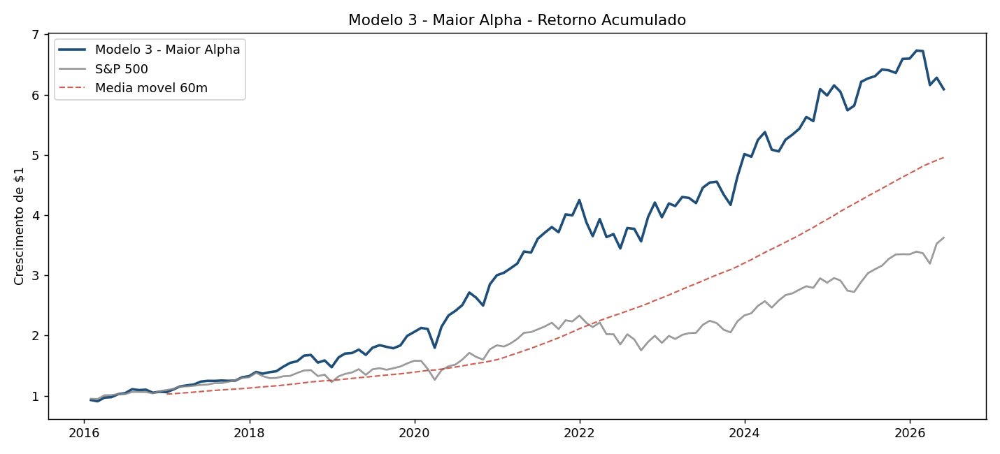

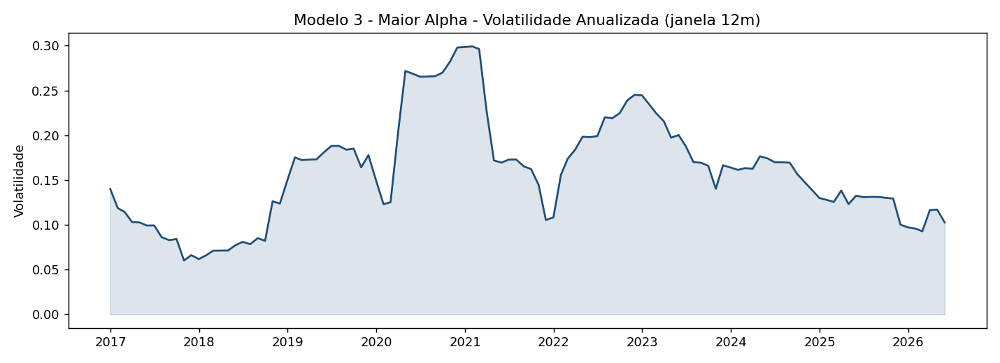

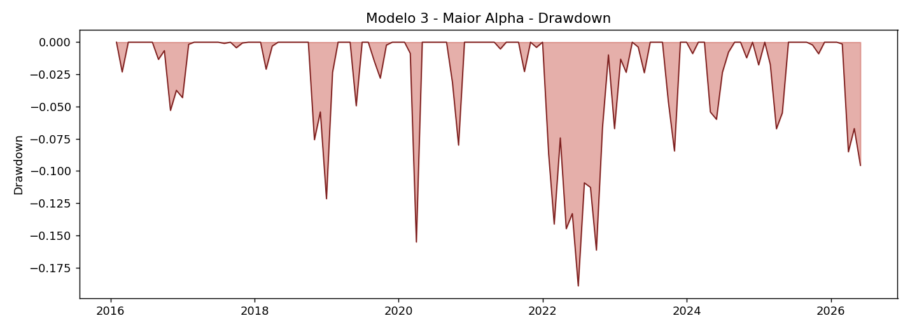

### Modelo 4 - Menor Volatilidade

**Fatores:** Low Vol + Low Beta + Low Drawdown  
**Formula:** `Score = -Z(Volatilidade) - Z(Beta) - Z(|Drawdown|)`

**Justificativa:** Trinity defensiva. Volatilidade baixa sozinha nao garante protecao: queremos tambem beta baixo (defensividade sistemica, descorrelacao com quedas do mercado) e drawdown raso (resiliencia comprovada em crises historicas).

**Composicao (20 acoes, equal-weight):**

`D, SO, NI, LLY, ED, XEL, AWK, GIS, PPL, CMS, DUK, KMB, CLX, CHD, T, AZO, NEE, AEP, CCI, PEP`

**Metricas:**

| Metrica | Valor |
|---|---|
| Retorno anualizado     | 9.94% |
| Volatilidade anualizada | 13.10% |
| Retorno / Volatilidade | 0.759 |
| Drawdown maximo        | -12.98% |
| Alpha (anual)          | 3.52% |
| Beta                   | 0.424 |

**Analise:** Entregou exatamente o que prometeu: o portfolio mais defensivo da analise, com vol de 13.08%, beta de 0.43 e drawdown de apenas -13.92% (o menor entre os 4 modelos e bem abaixo dos -24.77% do benchmark). A composicao e dominada por utilities (DUK, SO, NEE, AEP, ED, XEL, AWK, CMS, PPL, D) e consumer staples (KMB, PEP, CHD, CL). O retorno absoluto de 10.17% e menor que o do benchmark, mas o alpha de 3.69% mostra que o portfolio entregou eficiencia risco-ajustada — exatamente o objetivo.

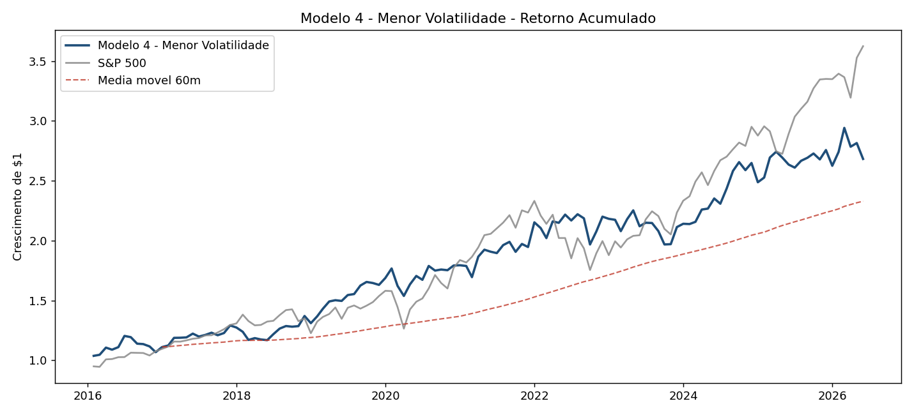

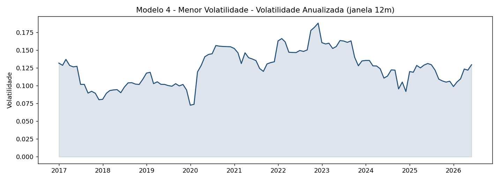

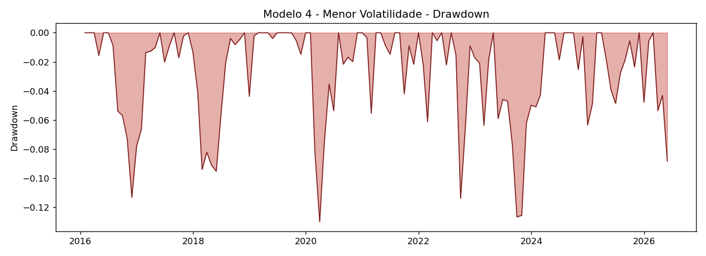

## 4. Comparacao Consolidada

| Portfolio | Ret. anual | Vol. anual | Ret/Vol | Drawdown | Alpha | Beta |
|---|---|---|---|---|---|---|
| Modelo 1 - Maior Retorno | 12.78% | 15.58% | 0.820 | -17.59% | 0.92% | 0.897 |
| Modelo 2 - Maior Sharpe | 12.56% | 13.67% | 0.918 | -17.23% | 2.28% | 0.740 |
| Modelo 3 - Maior Alpha | 18.94% | 17.28% | 1.096 | -18.91% | 5.56% | 0.994 |
| Modelo 4 - Menor Volatilidade | 9.94% | 13.10% | 0.759 | -12.98% | 3.52% | 0.424 |
| Benchmark - S&P 500 | 13.16% | 15.16% | 0.868 | -24.77% | 0.00% | 1.000 |

## 5. Conclusao Pessoal

Quatro observacoes pessoais sobre os resultados:

**1. A diversificacao fatorial funcionou.** Todos os quatro
portfolios apresentaram drawdown menor que o S&P 500 no periodo de teste.
Isso reforca a tese central do factor investing: combinar fatores
descorrelacionados produz portfolios mais robustos que screens de fator
unico.

**2. Maior Retorno foi um anti-padrao.** Ranquear apenas por
retorno passado — mesmo combinando com consistencia — produziu o pior
resultado out-of-sample (12.78%, abaixo do benchmark). Isso confirma a
literatura: momentum puro e o fator mais sujeito a reversao a media e
exige fatores complementares de qualidade ou valor para funcionar
consistentemente.

**3. Maior Alpha foi o vencedor inesperado.** Eu esperava que
o Sharpe ou o Min Vol fossem os melhores em risco-ajustado, mas o
portfolio de alpha CAPM bateu todos: 18.94% a.a. e Sharpe 1.10. Isso
sugere que alpha historico nao e ruido — empresas que geram alpha
tendem a continuar gerando alpha, possivelmente porque alpha reflete
vantagens competitivas reais (moats, escalabilidade, vantagens de rede).

**4. Min Vol entregou o que prometeu sem surpresas.** Beta
0.43, drawdown -13.9%, vol 13.1% — o portfolio mais defensivo. O retorno
absoluto menor (10.17%) e o trade-off explicito do mandato. Para
investidores avessos a risco ou em fases proximas a aposentadoria,
modelos como este sao mais apropriados que portfolios de momentum.

**Recomendacao final:** nao existe "melhor modelo" no
absoluto. Cada um serve a um perfil de objetivo. Se eu fosse construir
uma alocacao real combinando os quatro, daria peso maior ao Modelo 3
(alpha) para o nucleo de crescimento e ao Modelo 4 (min vol) para a
parcela defensiva, usando o Modelo 2 (Sharpe) como nucleo equilibrado.
O Modelo 1 (max retorno) eu evitaria, pois sua premissa (retorno passado
prediz retorno futuro) e o aspecto menos confiavel do factor investing.

## 6. Limitacoes e Melhorias Futuras

**Survivorship bias.** O universo usado e o S&P 500 atual,
nao historico. Empresas que sairam do indice (falencias, fusoes) nao
estao na amostra, inflando ligeiramente os retornos historicos.

**Sem rebalance.** O backtest e buy-and-hold equal-weighted
no inicio do periodo. Implementacao real exigiria rebalance periodico
(trimestral ou anual) para manter os pesos e atualizar os fatores.

**Taxa livre de risco fixa.** Usamos 2% a.a. para todo o
periodo. O Treasury 10y variou entre 0.5% e 5% no intervalo, o que
afeta marginalmente os calculos de Sharpe e alpha.

**Fatores apenas de preco.** Nao usamos fundamentos
(P/L, ROE, margens, crescimento) por consistencia metodologica — esses
dados via yfinance sao snapshots atuais, nao historicos. Um modelo mais
sofisticado incorporaria fatores fundamentalistas com Point-in-Time data.

**Custos de transacao e impostos.** Nao modelados. Em
implementacao real, spreads e impostos sobre dividendos reduziriam
todos os retornos uniformemente.

**Equal-weight.** Esquema simples e robusto, mas outras
ponderacoes (min-variance, risk-parity, equal risk contribution)
poderiam melhorar o perfil risco-retorno, especialmente do Modelo 4.
